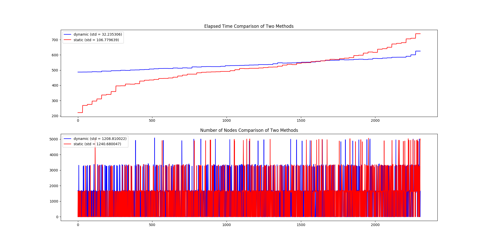

# Computational Data Science Lab

This is a repository for CISC Computational Data Science Lab

## Task 1

#### Files

### Task 1: Dynamic Assignment vs Static Assignment

Given a directed acyclic graph, for each node in the graph run BFS on the whole graph and find out how many nodes can be reached. To do this parallel, each BFS process should be assigned to a thread in GPU. We are trying to find out which method is more efficient:

1. After one thread finish traversal, the thread will find another node which hasn't been used and start a new BFS from this node. Amount of threads is fixed;  
2. Assign nodes to threads manually and each thread will run a BFS starting from the given point.

To compile, use following command:

```bash
$ nvcc -lcurand <source code> -o <execution output>
```

Arguments:

```bash
./<execution file> -f <file> -p<float> -t
```

- `--file`: `-f <file>`, graph file path;  
- `--probability`: `-p<float>` (no space), probability of edges;  
- `--thread`: `-t`, show elapsed time of each thread;

#### Known Bugs

- [ ] If the graph is large enough, there will be some memory errors on GPU. I'm not so sure whether it is caused by the limitation of my VRAM, which only has 3GB space; (This problem starts from dataset `dblp.txt` and all other graphs larger than it.)  
- [ ] ~~Recurrent queue has a fixed size, and if overflow the answer may be wrong, even the program may crash;~~ (temporarily ignore)  

### Comparison

This following charts shows GPU (3 x 3 blocks and 16 x 16 threads in each block) elapsed time on the given graph in file `wiki.txt`, which contains 8297 nodes connected by 103689 edges.

- Ubuntu 18.04.1  
- Intel i7-6700HQ  
- NVIDIA GTX 970M (Maxwell, 1280 CUDA cores, 3GB VRAM)  
- CUDA Toolkit 9.0


|const probability|dynamic (ms)|static (ms)|
|:-:|:-:|:-:|
|0.05|283.61|379.33|
|0.10|590.45|736.11|
|0.15|739.09|898.09|
|0.20|851.12|1006.92|
|0.25|921.48|1088.50|
|0.30|987.12|1158.25|
|0.35|1036.52|1202.17|
|0.40|1079.40|1259.86|
|0.45|1115.17|1278.72|
|0.50|1146.55|1315.31|

Following graph shows elapsed time of each thread and nodes visited by each thread. Some details are listed:

- dataset: `wiki.txt`;  
- probability: 0.1;  
- threads: 2304 (9 * 256);  
- total running time:  
    - dynamic: 602.79 ms  
    - static: 713.05 ms  


